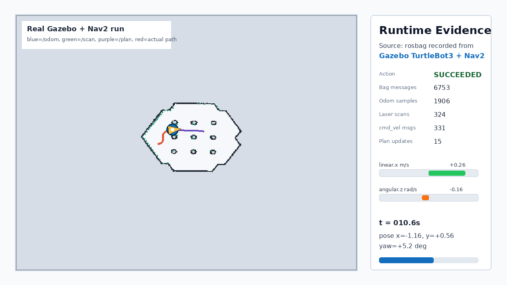

# ROS2 Nav2 TurtleBot3 Navigation Demo


<p align="center">
  
</p>

This repository contains a ROS2 Humble + Nav2 TurtleBot3 navigation demo with local run evidence captured in WSL Ubuntu 22.04. The final evidence run uses real Gazebo Classic TurtleBot3 odometry and laser scan topics, then drives the robot with Nav2 through `/navigate_to_pose`.

## Demo Evidence

Final real Gazebo evidence directory:

`demo/real_nav2_gazebo_20260606_220310/`

Start with [SUBMISSION_SUMMARY.md](./SUBMISSION_SUMMARY.md) for the task-to-evidence mapping.

## Demo Video

<p align="center">
  <a href="docs/videos/real_gazebo_nav2_run.mp4">
    
  </a>
</p>

The real run video is available at [docs/videos/real_gazebo_nav2_run.mp4](./docs/videos/real_gazebo_nav2_run.mp4). It is rendered from the recorded rosbag: blue robot pose comes from Gazebo `/odom`, green points from `/scan`, purple path from Nav2 `/plan`, red trail from the actual driven odometry, and the velocity bars from `/cmd_vel`.

Earlier visual recap videos remain archived at [docs/videos/nav2_robot_motion_replay.mp4](./docs/videos/nav2_robot_motion_replay.mp4) and [docs/videos/nav2_demo_recap.mp4](./docs/videos/nav2_demo_recap.mp4). The final acceptance evidence is the real Gazebo run above.

<p align="center">
  
</p>

Primary evidence files are in [demo/real_nav2_gazebo_20260606_220310](./demo/real_nav2_gazebo_20260606_220310/): Gazebo `/odom` and `/scan` samples, AMCL pose, Nav2 action result, rosbag metadata, topic/node/action lists, and the recorded bag database.

## Verified Results

| Check | Evidence |
|---|---|
| ROS2 environment | ROS2 Humble on WSL Ubuntu 22.04 |
| Gazebo sensor source | `turtlebot3_gazebo` published `/odom` and `/scan` before Nav2 goal execution |
| Navigation action | `/navigate_to_pose` finished with `SUCCEEDED` |
| Recorded bag | 6753 messages over about 69.6 seconds |
| Robot motion | `/odom` moved from about `(-1.99, -0.50)` to `(0.37, 0.47)` |
| Motion output | `/cmd_vel` 331 messages and `/plan` 15 messages in the bag |
| Sensors / TF | `/scan` 324 messages, `/tf` 3489 messages, `/tf_static` 1 message |
| Map | `map_turtlebot3_world.yaml/.pgm`, resolution `0.05 m/cell` |

## Project Overview

This project demonstrates a mobile robot navigation pipeline using ROS2 Humble, Gazebo Classic, TurtleBot3, and Nav2. The stack covers the core perception-planning-control loop: map loading, AMCL localization, global planning, local control, TF transforms, laser scan input, odometry, and velocity command output.

The final run was staged deliberately: Gazebo launched first and verified real `/odom` plus `/scan`; Nav2 launched second with the TurtleBot3 world map; `/initialpose` initialized AMCL; then `/navigate_to_pose` drove the Gazebo robot to the target.

## Architecture

```text
+-------------+    +-----------+    +------+    +-----+    +------+    +-----------+    +---------+
| Gazebo Sim  | -> |  Sensors  | -> | SLAM | -> | Map | -> | AMCL | -> |   Nav2    | -> | cmd_vel |
+-------------+    +-----------+    +------+    +-----+    +------+    +-----------+    +---------+
       |                |                                                   |
       v                v                                                   v
+-------------+    +-----------+                                     +---------------+
|  World/Env  |    | /scan     |                                     | /cmd_vel      |
|  Ground     |    | /odom     |                                     | Twist output  |
|  Truth      |    | /tf       |                                     +---------------+
+-------------+    +-----------+
```

## Project Structure

```text
ros2_nav/
|-- src/
|   `-- turtlebot3_nav2_demo/
|       |-- nav2_bringup/
|       |   `-- waypoint_follower.py
|       |-- scripts/
|       |   |-- record_nav.sh
|       |   |-- run_real_gazebo_nav2.sh
|       |   `-- replay.sh
|       `-- worlds/
|           `-- cluttered_office.world
|-- demo/
|   |-- real_nav2_gazebo_20260606_220310/
|   |   |-- README.md
|   |   |-- bag_sample_summary.txt
|   |   |-- real_nav2_bag_manual_info.txt
|   |   |-- navigate_to_pose_goal_result_tail.txt
|   |   `-- real_nav2_bag_manual/
|   `-- nav2_official_tb3_20260604_115048/
|-- docs/
|   |-- images/
|   |-- videos/
|   |-- FAQ.md
|   |-- real_gazebo_nav2_walkthrough.md
|   |-- control_algorithm_case_review.md
|   |-- technical_report.md
|   `-- urdf_analysis.md
|-- SUBMISSION_SUMMARY.md
`-- README.md
```

## Key Features

- SLAM-ready configuration using `slam_toolbox`
- Nav2 map server, AMCL, planner, controller, behavior, and BT navigator configuration
- TurtleBot3 Gazebo model and RViz visualization setup
- Custom world and modular launch files for simulation, SLAM, and navigation
- Local verification artifacts for nodes, topics, TF, map, goals, paths, and command velocity

## Quick Start

The committed repository is a runnable-case archive plus evidence pack. The final real Gazebo verification was completed in WSL at `/home/zexu/ros2-nav2-turtlebot3` and saved under `demo/real_nav2_gazebo_20260606_220310/`.

### Prerequisites

- Ubuntu 22.04
- ROS2 Humble
- Gazebo Classic
- TurtleBot3 packages
- Nav2 and SLAM Toolbox

### Install Dependencies

```bash
sudo apt update
sudo apt install ros-humble-turtlebot3-bringup \
                 ros-humble-turtlebot3-description \
                 ros-humble-turtlebot3-gazebo \
                 ros-humble-turtlebot3-teleop \
                 ros-humble-navigation2 \
                 ros-humble-nav2-bringup \
                 ros-humble-slam-toolbox

source /opt/ros/humble/setup.bash
export TURTLEBOT3_MODEL=waffle
```

### Launch Simulation

```bash
ros2 launch turtlebot3_gazebo turtlebot3_world.launch.py
```

### Run SLAM

```bash
ros2 launch slam_toolbox online_async_launch.py \
  slam_params_file:=./config/mapper_params_online_async.yaml
```

Drive the robot and save the map:

```bash
ros2 run turtlebot3_teleop teleop_keyboard
ros2 run nav2_map_server map_saver_cli -f maps/my_map
```

### Run Navigation

```bash
ros2 launch nav2_bringup bringup_launch.py \
  map:=/opt/ros/humble/share/nav2_bringup/maps/turtlebot3_world.yaml \
  params_file:=/opt/ros/humble/share/nav2_bringup/params/nav2_params.yaml \
  use_sim_time:=true
```

Open RViz and send a navigation goal with the `Nav2 Goal` tool.

### Reproduce The Final Real Run

```bash
/mnt/f/Work/Portfolio/ros2_nav/src/turtlebot3_nav2_demo/scripts/run_real_gazebo_nav2.sh \
  /home/zexu/ros2-nav2-turtlebot3/real_nav2_gazebo_repeat
```

See [docs/real_gazebo_nav2_walkthrough.md](./docs/real_gazebo_nav2_walkthrough.md) for the step-by-step explanation.

## Evidence Files

- `demo/real_nav2_gazebo_20260606_220310/README.md`
- `bag_sample_summary.txt`, `real_nav2_bag_manual_info.txt`
- `odom_once_gazebo.txt`, `scan_once_gazebo.txt`, `amcl_pose_once_manual.txt`
- `navigate_to_pose_goal_result_tail.txt`
- `nodes_after_goal_manual.txt`, `topics_after_goal_manual.txt`, `actions_after_goal_manual.txt`
- `real_nav2_bag_manual/metadata.yaml`, `real_nav2_bag_manual/real_nav2_bag_manual_0.db3`

## Case Review

The Chinese technical review for the ROS2/control-algorithm reflection task is available at [docs/control_algorithm_case_review.md](./docs/control_algorithm_case_review.md). It covers the problem, modeling, tuning process, and final results.

## References

- [ROS2 Humble Documentation](https://docs.ros.org/en/humble/)
- [Nav2 Documentation](https://navigation.ros.org/)
- [TurtleBot3 Manual](https://emanual.robotis.com/docs/en/platform/turtlebot3/overview/)
- [SLAM Toolbox](https://github.com/SteveMacenski/slam_toolbox)
- [Gazebo Classic](https://classic.gazebosim.org/)

## License

This project is licensed under the MIT License. See [LICENSE](./LICENSE) for details.
