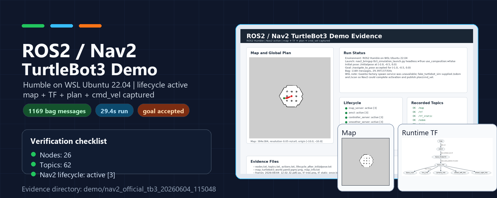
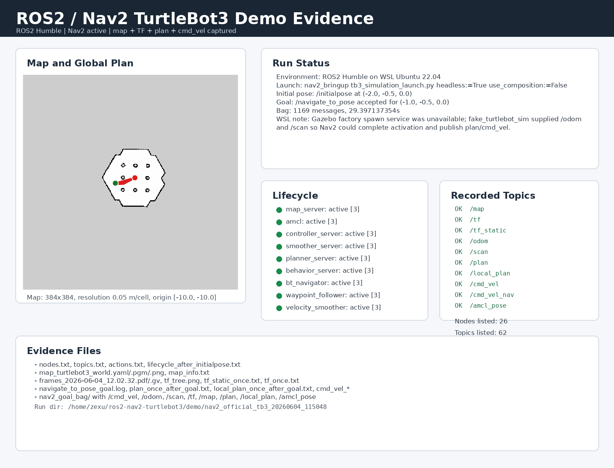
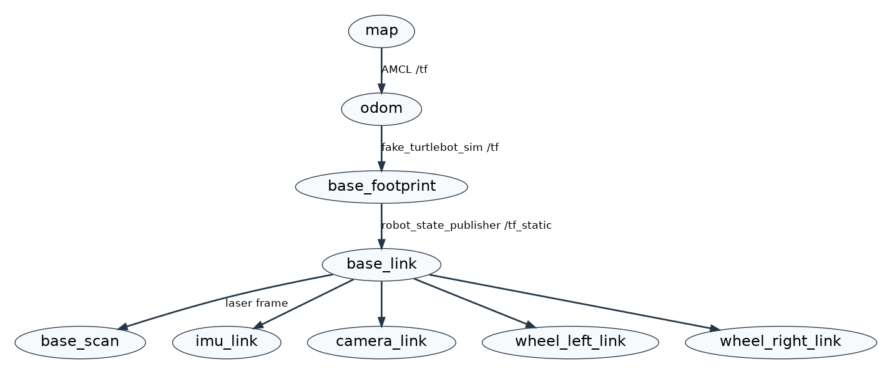
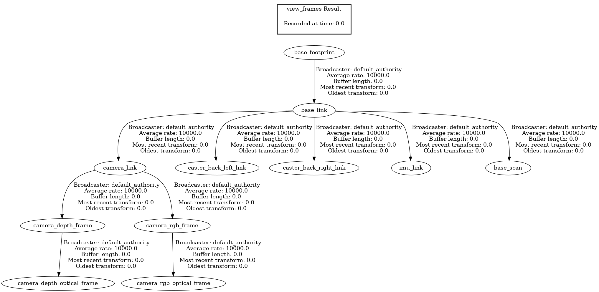

# ROS2 Nav2 TurtleBot3 Navigation Demo


<p align="center">
  
</p>

This repository contains a ROS2 Humble + Nav2 TurtleBot3 navigation demo with local run evidence captured in WSL Ubuntu 22.04. The verification artifacts cover nodes, topics, TF, map output, navigation goal execution, planner output, velocity commands, and a recorded ROS bag.

## Demo Evidence

Final evidence directory:

`demo/nav2_official_tb3_20260604_115048/`

Start with [SUBMISSION_SUMMARY.md](./SUBMISSION_SUMMARY.md) for the task-to-evidence mapping.

<p align="center">
  
</p>

<table>
  <tr>
    <td width="50%">
      
    </td>
    <td width="50%">
      
    </td>
  </tr>
  <tr>
    <td align="center"><b>Map evidence</b><br>Saved occupancy grid used by Nav2.</td>
    <td align="center"><b>Runtime TF evidence</b><br><code>map -> odom -> base_footprint -> base_link</code>.</td>
  </tr>
  <tr>
    <td colspan="2">
      
    </td>
  </tr>
  <tr>
    <td colspan="2" align="center"><b>Robot frame tree</b><br>Full TurtleBot3 frame structure from <code>base_link</code> to sensors and wheels.</td>
  </tr>
</table>

## Verified Results

| Check | Evidence |
|---|---|
| ROS2 environment | ROS2 Humble on WSL Ubuntu 22.04 |
| Nav2 lifecycle | `map_server`, `amcl`, `controller_server`, `planner_server`, `bt_navigator`, and related lifecycle nodes reached `active [3]` |
| Navigation action | `/navigate_to_pose` goal accepted |
| Recorded bag | 1169 messages over about 29.4 seconds |
| Nodes / topics | 26 nodes and 62 topics listed |
| Map | `map_turtlebot3_world.yaml/.pgm/.png`, resolution `0.05 m/cell` |
| TF | Runtime and static TF captured as text plus PNG/PDF diagrams |
| Motion output | `/plan`, `/local_plan`, `/cmd_vel`, and `/cmd_vel_nav` captured |

## Project Overview

This project demonstrates a mobile robot navigation pipeline using ROS2 Humble, Gazebo Classic, TurtleBot3, and Nav2. The stack covers the core perception-planning-control loop: map loading, AMCL localization, global planning, local control, TF transforms, laser scan input, odometry, and velocity command output.

The local WSL run exposed a Gazebo factory spawn-service issue, so the final verification used the official Nav2 launch while a small fake TurtleBot3 simulator supplied `/odom`, `/scan`, and `odom -> base_footprint` TF. This allowed the Nav2 lifecycle nodes to activate and publish planning and velocity outputs for acceptance evidence.

## Architecture

```text
+-------------+    +-----------+    +------+    +-----+    +------+    +-----------+    +---------+
| Gazebo Sim  | -> |  Sensors  | -> | SLAM | -> | Map | -> | AMCL | -> |   Nav2    | -> | cmd_vel |
+-------------+    +-----------+    +------+    +-----+    +------+    +-----------+    +---------+
       |                |                                                   |
       v                v                                                   v
+-------------+    +-----------+                                     +---------------+
|  World/Env  |    | /scan     |                                     | /cmd_vel      |
|  Ground     |    | /odom     |                                     | Twist output  |
|  Truth      |    | /tf       |                                     +---------------+
+-------------+    +-----------+
```

## Project Structure

```text
ros2_nav/
|-- config/
|   |-- nav2_params.yaml
|   |-- mapper_params_online_async.yaml
|   `-- turtlebot3_burger.yaml
|-- launch/
|   |-- gazebo_world.launch.py
|   |-- slam.launch.py
|   |-- navigation.launch.py
|   `-- full_pipeline.launch.py
|-- maps/
|   |-- my_map.pgm
|   `-- my_map.yaml
|-- worlds/
|   `-- maze_world.world
|-- rviz/
|   `-- nav2_view.rviz
|-- src/
|   `-- fake_turtlebot_sim.py
|-- demo/
|   `-- nav2_official_tb3_20260604_115048/
|-- docs/
|   |-- images/
|   |-- FAQ.md
|   |-- technical_report.md
|   `-- urdf_analysis.md
|-- SUBMISSION_SUMMARY.md
`-- README.md
```

## Key Features

- SLAM-ready configuration using `slam_toolbox`
- Nav2 map server, AMCL, planner, controller, behavior, and BT navigator configuration
- TurtleBot3 Burger model and RViz visualization setup
- Custom world and modular launch files for simulation, SLAM, and navigation
- Local verification artifacts for nodes, topics, TF, map, goals, paths, and command velocity

## Quick Start

### Prerequisites

- Ubuntu 22.04
- ROS2 Humble
- Gazebo Classic
- TurtleBot3 packages
- Nav2 and SLAM Toolbox

### Install Dependencies

```bash
sudo apt update
sudo apt install ros-humble-turtlebot3-bringup \
                 ros-humble-turtlebot3-description \
                 ros-humble-turtlebot3-gazebo \
                 ros-humble-turtlebot3-teleop \
                 ros-humble-navigation2 \
                 ros-humble-nav2-bringup \
                 ros-humble-slam-toolbox

source /opt/ros/humble/setup.bash
export TURTLEBOT3_MODEL=burger
```

### Launch Simulation

```bash
ros2 launch turtlebot3_gazebo turtlebot3_world.launch.py
```

### Run SLAM

```bash
ros2 launch slam_toolbox online_async_launch.py \
  slam_params_file:=./config/mapper_params_online_async.yaml
```

Drive the robot and save the map:

```bash
ros2 run turtlebot3_teleop teleop_keyboard
ros2 run nav2_map_server map_saver_cli -f maps/my_map
```

### Run Navigation

```bash
ros2 launch nav2_bringup bringup_launch.py \
  map:=./maps/my_map.yaml \
  params_file:=./config/nav2_params.yaml \
  use_sim_time:=true
```

Open RViz and send a navigation goal with the `Nav2 Goal` tool.

## Evidence Files

- `nodes.txt`, `topics.txt`, `actions.txt`
- `lifecycle_after_initialpose.txt`
- `runtime_tf_tree.png`, `tf_dynamic_after_goal.txt`, `tf_static_once.txt`
- `map_turtlebot3_world.yaml/.pgm/.png`, `map_info.txt`
- `navigate_to_pose_goal.log`, `plan_once_after_goal.txt`, `local_plan_once_after_goal.txt`
- `cmd_vel_once_after_goal.txt`, `cmd_vel_nav_once_after_goal.txt`
- `nav2_goal_bag/metadata.yaml`, `nav2_goal_bag/nav2_goal_bag_0.db3`

## References

- [ROS2 Humble Documentation](https://docs.ros.org/en/humble/)
- [Nav2 Documentation](https://navigation.ros.org/)
- [TurtleBot3 Manual](https://emanual.robotis.com/docs/en/platform/turtlebot3/overview/)
- [SLAM Toolbox](https://github.com/SteveMacenski/slam_toolbox)
- [Gazebo Classic](https://classic.gazebosim.org/)

## License

This project is licensed under the MIT License. See [LICENSE](./LICENSE) for details.
